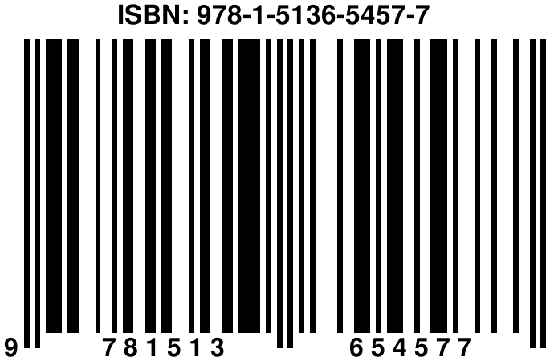

# Discussions and Copyrights

I finished all the evidences that hypothesized and provided reproducible tests. In this chapter, I want to share my own subjective thoughts on various topics regarding Quran and the 19 based coding system of its text. I will also share some of my personal thoughts about Quran and Islam. I ask you not to believe me straight away. I ask you to compare what I express about Islam with the message in Quran and in the end make your own conclusion. I am no expert in Quran and those are the subjective thoughts of an ordinary Muslim.

> "those who listen to what is said and follow the best of it. These are the ones (rightly) guided by Allah, and these are (truly) the people of reason.", Quran, (39:18)


So, you do not have to listen to experts only but you are the one who needs to use her mind and decide what is best for you and follow it.

### Reviews, feedback and contact {-#fw-rewiew}

First of all, what I presented as system in this book might still include some errors that I might not aware of. I performed this study all by myself and had no one to review this work. If in your ability, please do your best to review my codes and evidences and the book in general and provide some helpful critical reviews as feedback. For this, you can reach me on Twitter, in English via \@galtay19, or in Turkish via \@gokmen_19. I will first publish this book as only online e-book. After a while, regarding feedback, if needed I might update the online version and then publish a printed hard copy of this book. This book was first published online on 2019-09-07 and revised once on 2019-12-31. Between these times, I did not have a single specific objection on the coding parts of the evidences. I, myself, had some concerns about its complexity and simplified the rules and updated the book on 2019-12-31. However, this book will still remain as an online book for some more time for review purposes. 

The 19 based coding system I presented in this book might be just the tip of an iceberg and I do not know how much of it I could cover in this book. Since I concluded that I have discovered sufficient and substantial evidences proving that there is 19 based coding system in the text of Quran, I wrote this book based on the system that I could observe via my analysis on the text. If there is any substantial error in the book, it would be solely my unintentional mistake. Then, I would definitely take necessary actions to correct the mistakes. 

Lastly, there are clear evidences around Basmala, for instance, it has 19 letters and used 114 times in Quran. I did not include the known evidences in this book as I tried to introduce only novel evidences in this book. So, if you come across any other evidences that does not contradict with the rules of the 19 system of this book, feel free to consider them as other additional evidences. In short, I do not exclude any other available evidences but just do not include them in this book to make sure I present the new system with the new evidences only.

### Future works {-#fw-future}

This book was like my hobby project and I wrote it in my spare times after work times, mostly during weekends and on my holidays. Since my spare time is limited, I could not test all the possible hypothesis I had in mind. I encourage people with the ability and interest to investigate more on this and try to find other potential evidences. However, do never jump on a number as evidence as soon as you see it as divisible by 19, if it does not fit into a system of rules that you can define in. This is why I provided some 19 based examples as fact but not as evidence of the system. This book have sufficient examples for this types of approach. 

Especially, I would suggest investigators to investigate the text of each chapter separately. Also, there are already many suggested evidences in the literature about the Hurufu mukkatta letters (also called as "disjoined letters" or "mysterious letters"). I did not include them in this book separately. The first reason is that there are already many evidences on them. Second, they do not appear in all the chapters and in this book I tried to cover evidences that support the intactness of the full text of Quran. However, they are definitely worth investigating. My book also is a supportive evidence for those "mysterious letters" and shows that they are essential so that all the 19 based system I presented in my book holds. Without them, my system also collapses. However, I hypothesize that there may also be more specific evidences over them. I refer interested readers to the already available evidences available with an easy search over internet. I do not cite them here as I did not test them myself and not fully sure if the other available proposed evidences on the "mysterious letters" are correct.


Another suggestion would be is to work on per chapter. For example the 9th chapter (At-Tawbah) has 11115 letters and it is divisible by 19. Also, the 9th chapter (At-Tawbah) has 129 verses and when we write all the numbers from 1 to 129 and concatenate them, the big number is also divisible by 19. As seen in the 9th chapter (At-Tawbah), some chapters might have particular protection as it might be necessary! Each chapter worth investigating individually.


Another further study can be performed regarding the odd and even chapters and also verse sums of each chapter. There are some early simple examples in that direction such as the one in amazing19.com. They might be extended using the similar approaches I presented in this book. 


### My personal message to non-Muslim readers {-#fw-nonmuslims}

If you read this book and concluded that the text of Quran has a supernatural design, then, in my humble opinion, I suggest you to read its content. Before doing that, I would like to also suggest you to forget about any prejudices you might have about Muslims and consequently about Islam. To really understand the content of Quran, one should assume that this is totally a new book to read and just try to understand its message. Basically, forget about what you know or observed about Muslims, good or bad, and just read Quran without comparing it at all with Muslims. Because, things that you may consider negative about Islam are most likely not sourced by Quran but sourced by the traditional Muslim belief or simply the culture.

Long story short, I suggest you read Quran as if it was only sent to you from your Creator and try to understand the message as is. Islam is just whatever is written in Quran but nothing else. Islam is not what you see by looking at Muslims' life in general. Also, I suggest you never fully believe any historical reports, except Quran, about Prophet Muhammad. Prophet Muhammad is already best and most truthfully reported in Quran by God. 


### The gap between Quran and the traditional Muslim belief {-#fw-tradition}

Unfortunately, in our current time and probably for a long time, traditional Muslims, which are most of all, have a big gap between Quran and themselves. Most of the non-Arabic speaking Muslims do not even read the translation of Quran in their own language to understand but just recite from its Arabic text without understanding what God tells them to do. This insane practice is so pervasive among non-Arabic speaking Muslim countries. This is not because people prefer to do it themselves but they have been instructed and encouraged to do so by the scholars or imams. Traditional Muslim belief dictates the idea that ordinary people cannot understand Quran themselves alone and they must listen to scholars who are expert in Quran and the other sources. They do not stop there and even dictates the traditional idea that Quran is not sufficient to understand alone and one **must** consider those claimed hadith reports (written down about, roughly speaking, 200 years later after the death of Prophet Muhammad) to fully understand Quran! They claim that Quran is not detailed enough to understand and live the religion of God and it was explained and explained and practiced in necessary details only by Prophet Muhammad and thus we **must** read claimed hadith reports to fully understand the message in Quran.

This way, they confine Quran within those historical claimed hadith reports of which no one really knows or agree on their exact total number or accuracy. The end result of this strongly dictated traditional idea is that ordinary Muslims feel obliged to listen to and follow scholars, who were also raised and educated by the traditional Muslim belief. Since this traditional teaching has been injected to the minds of ordinary Muslims from childhood till their old ages, they can not really trust the verses of Quran when they read themselves alone because they have been brainwashed that they cannot fully understand it or they can misunderstand it themselves. Thus, they look like they are afraid to understand the verses in Quran and infer a meaning out of it by themselves. They trust the meaning of the verses of Quran only when a scholar or an imam explains the verses for them. However, this idea is against the message in Quran. Among may other related verses, I will quote only these verses to keep it short here:

> "Alif. Lam. Ra. This is a Divine Command whose contents have been made firm and set forth in detail from One Who is All-Wise, All-Aware.", Quran, (11:1)

>"that you may worship none but Allah. Verily, I have come to you as a warner and a bearer of good news from Him", Quran, (11:2)

It appears to me, God simply informs us that Quran is already detailed and it is done as such so that we do not worship anyone other than God. When we think the opposite of this meaning, if Quran was not detailed enough, we would be in need of scholars who explain Quran for us and this feeling or situation of being in need of anyone else other than God to understand God, then can be considered a form of worship to someone else other than God. There are different forms of worship. From the context, I understand that if one has the belief he **has to** listen whatever the scholars or imams say is what God tells him then it means he basically locates them as **imperative intercessors** between him and God to receive the message of God. However, this situation is against the main message in the Quran. Because a Muslim never needs anyone to connect with God. The classic traditional argument to these verses might be that they would say "we do not worship to the scholars nor imams". Then, Let's remember the meaning of worship again. Worshiping means "show reverence and adoration for (a deity); honor with religious rites (a simple Google search verifies this). The feelings that we **must** listen to those **imperative intercessors** and follow them to understand God's message has the potential to bring additional divine respect, a reverence, to those intercessors. Because their position in our life is in between God and ordinary Muslims. The end result of this feeling is that Muslims listen to them and accept whatever they say about religion without comparing them with Quran. Listening to those intercessors and trusting and obeying their words as if whatever they say is what God wants us to do is a form of worship. Because we listen and obey to those intercessors and we do not really know if what they say aligns with Quran or not. Because, in practice, we show more trust to them than we show trust to Quran. This is because traditional Muslims have been raised so from childhood. The end result of this situation is almost all the negative things that we observe mostly in the Muslim countries or even among Muslim communities abroad. Many traditional teachings have been instructed by the traditional scholars or imams as if they are the instructions of God despite the fact that many of them are either not in Quran or against Quran.

In short, traditional Muslims, the great majority, listen to scholars or imams and try to live their religion accordingly. They do not read Quran themselves and use their own minds to understand and live according to what they understand from Quran. They only follow the instructions in Quran, regarding what their imams tell them about it. This is not by choice of people but by the dominant traditional Muslim belief that have been keep fed into the minds of traditional Muslims. The main direct relation between Quran and ordinary Muslims, without the intercession of imams, is constantly keep reciting the verses of Quran in Arabic without understanding it. They were taught that they will be rewarded if they keep reciting it even if they do not understand it despite the fact that there is no such verse in Quran. In contrary, anyone who reads Quran realize that God constantly instruct us to use our minds and speak to our minds. Thus, there is a big gap between traditional Muslims and Quran. This is no surprise as All knowing God had warned us about it with this verse, where Prophet Muhammad complains about Muslims in the Day of Judgement.

> "The Messenger has cried, “O my Lord! My people have indeed received this Quran with neglect.”, Quran, (25:30).


### The source of Islam religion {-#fw-source}

Many of the things about Muslims that do not seem to align with universal values are not sourced by Quran. Then, you might wonder that why do you see some negative practices by Muslims, especially around women. The answer is that traditional Muslim belief do not accept Quran alone as their source of religion, which is Islam. Along with Quran they also have claimed historical reports, Hadith narratives, of Prophet Muhammad and the **consensus** (Ijma) that is the agreement of some early Islamic scholars on a matter of Islamic law mostly in the past. Hadiths are claimed reports about any sayings, actions and approvals of Prophet Muhammad. However, even the most trusted hadith sources, like the book of Buhari, can only be dated back to around 200 years after the death of Prophet Muhammad. Since this is not the main topic of this book, I will not go into more details on this point. But, in short, we can never know and never be sure if any of the claimed hadith reports are %100 correct. The claimed Hadith reports are not like Quran and God only promised to protect Quran but no other book. If The claimed hadith reports were source of Islam as well in the sight of God, then All powerful God would certainly made them recorded like Quran and protected them just like the Quran from the beginning. God knows best but in my humble opinion, this point is another rationale proof that the claimed hadith reports cannot be source of Islam in the sight of God. Some of the hadith reports may be correct, some may be partly correct but some are also false. Any people with the power among Muslims in the history had the ability to seed some hadiths of their wish and transform Muslims' life accordingly. Especially women was the first affected who got most damage from this way.


There are known to be around more than a million reported claimed hadiths. Some scholars, like Buhari and Muslim, are said to filter them with respect to their own personal judgement and, in their hadith books, kept only the claimed hadith reports if they considered them as "correct"  **after around 200 years later** from the death of Prophet Muhammad. Even this information alone should trigger minds of rational Muslims with this question: How can a book be the source of religion along with Quran when it is claimed to be written around 200 years after Quran. I said claimed reports because even those original copies of the hadith books do not exist and copies of the oldest hadith books scientifically can be dated back to only around 400 years after Quran was written. I got this information on my personal research on the topic, but feel free to do your own research. Even if the content of those book really correct, this information alone proves that those hadith books cannot be source of Islam religion, religion for all humanity for all times. If such hadith reports were needed, then we would expect from God to order Prophet Muhammad to make his hadiths recorded or memorized along with Quran as well. Because Quran is for all humanity and for all times. If there was really a need for the hadith reports of Prophet Muhammad then they would definitely made recorded by Prophet Muhammad. This is because, he perfectly fulfilled his duty as a prophet and messenger. Otherwise, ironically, traditional Muslim belief, that seemingly is pro-prophet, accuses Prophet Muhammad not doing his duty in full, which is not acceptable. We have Quran and, without doubt, we know Prophet Muhammad has fulfilled his duty perfectly. Since the source of religion is only Quran and there is no other book needed, Prophet Muhammad did not make his hadiths recorded. 

In short, I invite all Muslims to accept only Quran, message of God, as the source of Islam but nothing else. But, the traditional Muslim belief instructs you to follow the previous Muslim scholars or forefathers. See what God revealed in Quran about a similar situation:

> "When it is said to them, "Follow what Allah has revealed," they reply, "No! We (only) follow what we found our forefathers practicing." (Would they still do so,) even if their forefathers had ˹absolutely˺ no understanding or guidance?", Quran, (2:170).


> "Is God not enough for His servant? Yet they threaten you [Prophet] with those they worship other than Him. If God allows someone to stray he has no one to guide him;", Quran, (39:36).


The first argument by the traditional Muslim scholars to these pure message is that, without the claimed hadiths, a Muslim cannot even perform correctly her daily prayers with the ritual and also similarly other known practices. This is actually quite a funny and pity question. Because the questioner by default presumes that all the things he knows about Islam is correct and since they are not in Quran with the details they claim there are, then they conclude that Quran is not detailed enough and they must refer to the claimed hadith reports. I will keep this answer short for them here. Quran does not have to include your incorrect beliefs. Your distorted understanding of the religion does not have to be in Quran. The prayers, fasting, cleaning, charity and all the other similar Muslim practices are explained in Quran in sufficient detail as God wishes. Those who raise such objection, I suggest you know your coordinates and do never even attempt to teach the religion to God!

> "Say: "What! Will ye instruct Allah about your religion? But Allah knows all that is in the heavens and on earth: He has full knowledge of all things." ", Quran, (49:16).


### The sects among traditional Muslims {-#fw-sects}

As you see, the sources of the traditional Muslim belief are too much for ordinary Muslims to follow and learn themselves. This is one of the other reasons why there exist so many sects and branches among Muslims despite the fact that they all accept the same exact Quran and same prophet. Then, what is the source of their difference in their belief? Simply put, their trusted scholars are different and as they follow them regarding where they were born, they have a different branch within the traditional Muslim belief. Basically, all accept the same Quran but each accept different parts of claimed Hadith reports or Ijma rules and in the end they have a different branch and become a different types of Muslim of a different sect. This is why, in different Muslim countries, you see various types of Muslims in their belief. This situation is again despite the verse they read in Quran but do not take a lesson:

> "Surely you have nothing to do with those who have made divisions in their religion and become factions. Their matter is with Allah and He will indeed tell them (in time) what they have been doing.", Quran, (6:159)

Also, in the following verse, it is clear that the Quran (Scripture) was sent down to Muslims and **explaining everything**. There are also many other verses that informs that the Quran is a detailed book.

>"The day will come when We raise up in each community a witness against them, and We shall bring you [Prophet] as a witness against these people, for We have sent the Scripture down to you explaining everything, and as guidance and mercy and good news to those who devote themselves to God.", Quran, (16:89)


### A bad example of the tradition despite Quran {-#fw-bad-ex}

Traditional Muslims have been instructed that they cannot learn their religion in necessary details by just reading Quran and thus they need the claimed Hadith reports and even Ijma. Since the sources become too much for an ordinary Muslim to learn, comprehend and infer any rule from them, **they must listen and follow** scholars who know those details. This is why all traditional Muslims feel forced to or listen to scholars who mostly dictates traditional rules of the traditional Muslim belief. In that case, regarding any given situation, scholars mostly able to find a way to match any given situation to their traditional belief. This has been very favorable situation for the leaders of Muslim countries throughout the history and today. It is not too hard for them to control the scholars and thus the traditional Muslim people who feel obliged to listen to the scholars. In the history of Muslims, there are many pity examples that some scholars who openly disagree or do not bend to the leader of the country is imprisoned or killed. Once they managed to add sources other than Quran as the information source of Islam, then they can make implement other things of their wish although they are not in Quran and even against Quran. The most extreme example of this situation is the death penalty for a Muslim who openly abandon Islam, apostasy ("murted" in Arabic). In fact, this is totally against Quran. There is no such instruction and it is against the over all message one can infer after reading Quran and additionally, God clearly informs us with this verse:

>"There is no compulsion in the religion...", Quran, (2:256) 

Nevertheless, there is a claimed hadith report exists in the most authentic hadith books like Buhari, and in that, regarding a **claimed hadith** report, the Prophet instructed to kill the ones who abandon religion by saying this: "Whoever changed his Islamic religion, then kill him.". I fully reject this claimed hadith report. I believe that this is one of the false reports as it does not align at all with Quran. Prophet Muhammad only and only follows Quran and cannot say anything at all that contradicts with Quran.

> "Had the Messenger made up something in Our Name,", Quran, (69:44)

> "We would have certainly seized him by his right hand,", Quran, (69:45)

> "then severed his aorta,", Quran, (69:46)

However, traditional Muslim belief do not reject this controversial claimed hadith about apostasy but interpret it in various ways as they like. As you see, in this extreme example, depends on the time and situation any independent and critical Muslim scholar against the traditional Muslim belief or a leader might be declared as apostate and might be killed. This is one of the other reasons why traditional Muslim belief is so strongly persists in Muslim countries throughout the history and now. As long as this claimed hadith is accepted as correct and thus it is from one of the accepted sources of religion, then anyone who denies this claimed hadith report can be easily declared as apostate (murted) and be killed. A **super clever** one might have seeded this claimed hadith report into among thousands of claimed hadith reports and with this particular claimed hadith, in a way, all the other claimed hadith reports are protected against any further criticism. Because, anyone who reject one of the hadiths might well be declared as apostate and be killed. I am not saying this happens always among Muslims but what I am saying is that as long as that hadith report is within the trusted hadith books like Buhari, there is always a way to do such a thing and can be used. Then, there is really no freedom of expression in Muslim countries among Muslims, especially back in history. I am able to write this book and make these critiques about the traditional Muslim belief without really feeling significant danger to my life because I live in a Western country, United States of America, where freedom of speech is really exist at some good level. However, to be honest, while writing these critiques about the traditional Muslim belief, I still accept the risk of potential danger to my life anyway. Because, this is a real thing and there are unfortunate examples in the past. For example, Rashad Khalifa, who was an early prominent critique of traditional Muslim belief and was strongly supporting the idea that the source of Islam is only Quran, was assassinated in Arizona in 1990. He was also the author of the **made up and false 19 system** claim, where he had manipulated the text of Quran to match it to his own made up numbers. Back to the point, as a Muslim who try to follow Quran fully, in my ability, I have to relate and speak up the truth in Quran no matter what.

### No violence in Islam {-#fw-violnace}

This topic needs more detailed explanations but this book is not about it mainly. Therefore, I will shorty touch to this important topic as the perception about Muslims is not too distance from violence because of, first the biased media, and, second, the many bad examples by some traditional Muslims we saw in history and now. I know that the media mostly is exaggerating the negative examples about Muslims who are around 1.8 billion people on earth. However, they are there and we have to make an explanation for them.

In short, there is no violence at all in Islam regarding Quran but those bad examples are based on some of the claimed hadith reports or the consensus. I explained before that I reject all the claimed hadith reports as the source of Islam. They are just historical claimed reports and we can get some historical and thus blurred information about past. We can also utilize them to learn about Arabic language of the past as well. As long as they are not considered as the source of Islam, then those claimed hadith reports can also be studied, **if wished**, to understand a topic in the religion. If the approach is just like to listen any other **preferred** scholar's opinion that we might consider to understand a topic in religion, then one can also utilize from them while trying to understand a topic in the religion. However, this is a very sensitive case as one might be biased towards the claimed hadith report rather than objectively consider it along with all the other information about a topic. Therefore, be warned that if one has any bias towards them, then there is always potential to infer incorrect biased conclusion on an issue.  

Back to the main topic, once you only take Quran as the source of Islam, then you cannot apply violence to anyone. The only way Quran allows violence is as a self defense. Self defense of individual or self defense of a community like a country. And this is a universal rule for all humanity. The only verses that are claimed to order violence without self defense is mostly interpreted wrongly although the translation is clear. 


> "Fight in the cause of Allah (only) against those who wage war against you, but do not exceed the limits. Surely Allah does not like transgressors." (2:190)

> "Kill them wherever you come upon them and drive them out of the places from which they have driven you out. For persecution is far worse than killing. And do not fight them at the Sacred Mosque unless they attack you there. If they do so, then fight them—that is the reward of the disbelievers." (2:191)

As we see it is clear that God orders Muslims to self defense by instructing "Fight in the cause of Allah (only) **against those who wage war against you**". The practices of Muslim states in the past, which does not align with this verse, is nothing to do with Quran but with their own traditional belief.

The other verse that is misunderstood by most are these:

> "As for the polytheists who have honoured every term of their treaty with you and have not supported an enemy against you, honour your treaty with them until the end of its term. Surely Allah loves those who are mindful (of Him).", Quran, (9:4)

> "But once the Sacred Months have passed, kill the polytheists (who violated their treaties) wherever you find them, capture them, besiege them, and lie in wait for them on every way. But if they repent, perform prayers, and pay alms-tax, then set them free. Indeed, Allah is All-Forgiving, Most Merciful.", Quran, (9:5)

As we see from these two verses, God informs us only within a context. First, regarding verse 9:4, if there is a treaty between Muslims and polytheists within a community then Muslims must obey it. In our current time within a country, we all have under the treaty of a citizenship with other people of any faith. Therefore, all Muslims must respect it even if the country is a majority Muslim country. Any visitor to that country is also considered as under the visitor treaty and thus Muslims must live in peace with all people on earth as long as they both honour their treaty. This is the general rule Muslims might infer from this verse for our time in my humble opinion. Moreover, in the verses, God informs us about a particular polytheists community who live along with the first Muslim community. This is because there is the word "the" definite article in front and they are mentioned as "the polytheists". So, the verse is not informing about all polytheists but a particular group of polytheists even if some other Muslims tries to interpret the meaning of the verse differently. In conclusion, there is no way to infer violence against non-Muslims from this verse in general.

Second, in regard to (9:5), God gives Muslims three options for those who violate the treaty with the Muslim community, which are kill, capture and besiege. It is logical to understand that anyone who are killed cannot be captured or besieged. So, it is easy to understand that these are the options left to Muslim law enforcement officials to deal with the ones who violate the treaty. This verse perfectly align with modern rules. Imagine that there is a terrorist person or a group of people in a modern country. Law enforcement official immediately arrive there and choose their best option and implement it. Their options are to kill, capture or besiege them depends on the situation at that very moment. This verse gives Muslims to be able act similarly. Otherwise, Muslims, even the low enforcement officials, would be hesitant to kill anyone because there are many many verses in Quran advising against violence. There is even this clear verse:


> "That is why We ordained for the Children of Israel that whoever takes a life—unless as a punishment for murder or mischief in the land—it will be as if they killed all of humanity; and whoever saves a life, it will be as if they saved all of humanity. (Although) Our messengers already came to them with clear proofs, many of them still transgressed afterwards through the land.", Quran, (5:32).

Although, in the context there is Israel, we Muslims all should take lessons from all verses. Thus let's read the related part again in bold: "**... whoever takes a life—unless as a punishment for murder or mischief in the land—it will be as if they killed all of humanity; and whoever saves a life, it will be as if they saved all of humanity...**".

Any Muslim, who read this verse among others, would never be able to kill anyone if God did not inform us with the other verses that orders self defense as well. This is a long topic and I leave it here for now.

I will present these verses as proof that Muslims must always behave peacefully according to Quran.

> "He has already revealed to you in the Book that when you hear Allah’s revelations being denied or ridiculed, then do not sit in that company unless they engage in a different topic, or else you will be like them. Surely Allah will gather the hypocrites and disbelievers all together in Hell.", Quran, (4:140).


> "And when you come across those who ridicule Our revelations, do not sit with them unless they engage in a different topic. Should Satan make you forget, then once you remember, do not (continue to) sit with the wrongdoing people.", Quran, (6:68).

As we see there are two different but similar verses and in both of them God orders Muslims to behave peacefully and not conduct any violence even in an extreme situation that is when there is an insult on Islam. God also orders Muslims to stay away only until the insulting people stop their wrongdoing and do not forbid Muslims to interact with them again when they are not keep insulting. It is not because the insult is not important but it is because God will punish them hereafter (unless they ask forgiveness from God). How about the most extreme case where God informs how to behave with those who insult even to God and the Messenger:


> "The hypocrites are afraid that a Sūrah (a chapter of the Holy Qur’ān) may be sent down about them, which tells them what lies in their hearts. Say, “Go on mocking. Allah is surely to bring out what you are afraid of.", Quran, (9:64).

> "And if you ask them, they will say, “We were just chatting and having fun.” Say, "Is it of Allah and His verses and His Messenger that you were making fun?", Quran, (9:65).

> "Make no excuses. You became disbelievers (by mocking at Allah and His Messenger) after you had professed Faith. If We forgive some of you (who repent and believe), We shall punish others (who carry on their hypocrisy), because they were guilty.", Quran, (9:66).

The verses are very clear that God does not order any worldly penalty for those who even mock about God but warns those with hell fire in the verse 9:68. However, we Muslims are also human beings and we can still express our reactions in this world in a peaceful manner as this was not forbidden as well. Anyone who follows Quran cannot make violence for no reason other than self defense. However, as I said previously, traditional Muslim belief also accepts other sources for their belief and that might cause different implementations in practice by some of them.

When I explain this matter to my friends who are well educated and peaceful but follows traditional Muslim belief as most, they say "there are also some verses in Quran for violence and its not only the claimed hadith reports". This is the information from friends who are above average of traditional Muslims. They do not know really Quran, because, as I explained before there is a gap between traditional Muslims and Quran. They do not know Quran well because they listen to scholars or imams to learn about religion. Since those scholars combine Quran with the other two sources, the end result is not only Quran but those other immense number of things written in those old books. Even the scholars of the traditional Muslim belief cannot comprehend the above verses I shared, then how can an average Muslim do? When I had a traditional Muslim belief, I had asked about this question to a well known scholar. I asked him, considering history, how can we say Islam is a religion of peace? He, as one of the most modest scholar, replied us, "this is a big lie!". Because he was modest, he was a bit more courage to confess things he considers wrong. Everyone who listen to him were peaceful traditional Muslim but none of us could reply his answer otherwise. Because, we ordinary Muslims are ignorant of Quran because we do not really know Quran as we have been under brain washing is the traditional Muslim belief since our childhood. It is very difficult to even consider the things I have been writing in this chapter about the traditional Muslim belief. In this chapter, I hope, their minds triggered after reading all these information and read Quran again considering my warnings. Do not believe me but believe God via Quran. And please trust the words of God, Quran, and your own mind more than you trust those imams and scholars...


### At my age 40, I became a Muslim of Quran {-#fw-ageforthy}


Unfortunately, I was one of those traditional ordinary Muslims who would follow the traditional Hanafi branch (called mezheb in Turkish) as most Turkish people do in Turkey. Fortunately, after reading and listening some enlightened scholars over the internet last year, I came across with the message that the source of Islam religion can only be Quran according to Quran. I did not jump into this idea right away but it triggered me to investigate on this. It was not too hard as we Muslims have the same Quran. I read Quran again while testing those claims over the verses which was hard to accept as it was against my strong beliefs that I was raised and lived with all the years. However, after reading Quran to learn and understand what God says and instructs us to do, at my age 40 in 2019 sometime before Ramadan, I corrected my belief and **accepted Quran alone as the source of my Islam religion**. After then, everything around my Islamic life appeared to be more reasonable and aligned with the daily life. Living Islam turned out to be quite easy and livable without ignoring things that you can neither reject nor fully accept. However, I then realized that how lonely I turned out to be in that situation. People even treated me as if I abandoned Islam when I openly discuss my opinions with my people around me. But, no matter what, I am very happy that God guided me to this pure message. Because first time in my life, I really feel that what God wants from me to do directly. Before that I was looking at the mouths of scholars and the preaches of imams and thus limited and directed with what they say. There was always intermediaries for me to understand what really God orders me to do. Since the topic of this book is not this, I will not going to much detail about this. However, so far, I am very happy with my spiritual life and repented for the wrong beliefs and practices I had in my previous life. When, I read Quran it is like speaking with God and my heart is delighted when I read and know that I do understand what God says to me and contemplate accordingly. I used to know this verse but only now I witness its meaning:

> "the ones who believe and their hearts are peaceful with the remembrance of Allah. Listen, the hearts find peace only in the remembrance of Allah.", Quran, (13:28).

The last thing I want to share about this situation. I had heart about 19 system long years before but I never thought I would be able to research on it myself and test some of pre-existing claims on it because I did no know Arabic and also no much interest on this. However, around after purifying my belief and accept Quran as the only source of my Islam religion and repent for my past, I became more interested on Quran. I am currently a data scientist and ability to wrangle about data but had no experience to work with Arabic text data. I just made a Google search to see if there are some tutorials on the text of Quran and found one in R. I gave it try and made some hypothesizes and witness some successes. then I put forward more hypothesis and  witnessed more evidence and decided ti write this book. The point I explain it here because, in my subjective opinion, God showed me those evidences and allowed me to write such a book only after I purified my belief in Islam. I am not saying about purification of my humanly sins but I mean the traditional Muslim belief I used to accept and follow.


### The discovery date of this system {-#fw-discoverydate}

I have discovered the 19 based system that presented in this book in 2019. Only God and me know this for sure. So, you do not have to believe me on this. However, since the date of the discovery and publication of this book has an interesting 19 based pattern, I would like to share it here too. As, I mentioned before, regarding historical reports, the revelation of the Quran lasted around 22 years and is was completed by 632. Since the 19 based system is on the complete Quran, I took 632 as reference.

2019 - 632 = 1387

> 1387 = 19x73 

> 1+3+8+7=19

As we see two 19 based relations exist. 

Moreover,  if we look at regarding its entrance into the history, there is again an interesting 19 based relation. When we enter in 2019, I had not discovered this 19 based system and there was no book as well. Basically, no one on earth, including me had any knowledge on this. However, when 2019 ended, the real 19 based coding system of the full text of Quran was discovered by myself and its miraculous evidences were published in this book. Let's look at the last date of 2019 then.

If we write this date in American way (as the discovery were made in USA):

The last date of 2019 is 12-31-2019 and this date alone also has **three** 19 based relation as follows. The classic concatenation of them gives us a single representation number:

> 12312019 / 19 = 648001  (Also 6+4+8+1=19!) and 

> 1+2+3+1+2+0+1+9 = 19!

We observed three 19 based relations in the same date. If anyone argues on the order of the date, here are the alternative way of writing this date considering the rest of the world. It has also 19 based relation:

> 31122019 / 19 = 1638001 (Again 1+6+3+8+1=19!)

Again, we observed two more 19 based relations in the same date, which makes five in total. This is just an interesting fact that might show historically an interesting relation between the beginning and end of 2019 with respect to the entrance of this system and book into the literature.

### Some relevant verses {-#fw-relvves}

Here are some verses and their numbers, where both the content and their numbers might be relevant to the 19 based coding system of the text of Quran.


Muslims certainly believe that Quran is intact, unchanged and protected as it was promised so by God. 

> "We, indeed We, it is We who have sent down the Reminder, and indeed it is We who will preserve it.", Quran, 15:9

This verse is the verse 1824 out of the total 6348 verses. 1824 is also divisible by 19 as 1824/19 = 96. Moreover, instead of Quran or The Book, God uses the word Reminder or Recitation, (in Arabic:  الذكر ), which refers to the memorized Quran that is verbally recited. There are two miraculous sign here. First, Quran has been conveyed until today via memorization. There is no known complete first written copy but there are hundreds of thousands people around the world who fully memorized Quran as an historical tradition. Second, sign is the word Reminder (in Arabic:  الذكر ) has been used exactly 19 times in overall Quran. You can test this in Chapter \@ref(textTMuw) with the dynamic table, Table \@ref(fig:uwords-table99). Just copy and paste the Arabic word in the search box of the table and see the word count of it in Quran.


> "that cannot be approached by falsehood, neither from its front, nor from its behind -a revelation from the All-Wise, the Ever-Praised.", Quran, (41:42).

God informs us that falsehood cannot approach Quran from its front nor behind. If you remember the evidences I provided, some of them were based on direct indices (left to right) and some from from the back (from right to left as in Arabic). The reason I considered this might be sign for the 19 based coding system is because 4142 is also divisible by 19.

How about this one, which has very relevant numbering along with its meaning:

> "That He may know they have already proclaimed the Messages of their Lord. And He has encompassed (all) that is closely (kept) with them, and He has enumerated everything in numbers.", Quran, (72:28).

There are two very interesting 19 signs on this verse. First, the digit sum of 7228 is 19. However, this might be only an interesting sign as no such rule is defined in general anywhere and we can never claim of such connection for sure and God knows best as always.

This is the key verse for the 19 based coding system.

> "Over it is Nineteen", Quran, (74:30)

Interesting enough, the first verse of the chapter of this verse is this"

> "O you shrouded (in your mantle)," Quran, (74:1)

The parenthesis is not the translation but the meaning assumed by the translator (Dr. Ghali from quran.com). So, basically the first verse of this chapter is "O you shrouded". Although the traditional interpretation is different, I suggest that this verse might also refer to the hidden (shrouded) 19 based coding system of the text of Quran. God knows best and this, I consider as one of the possible interpretations.

There are three reasons that caused me think as such. First, this is the first verse of the chapter in which we observed the verse "Over it is Nineteen" (74:30) that might connect the 19 based system of the text of Quran to the content of Quran. Also the literal meaning of the verse "O you shrouded" seem to be perfectly aligning with the unknown 19 based system of the text of Quran. Second, when we perform the classical concatenation coding operation to the chapter and verse indices (74:1) we get 741 and it is divisible by 19, which stands as a sign that further supports this interpretation. Third reason is that this verse is *mutesabih* type of verse, which means it is open to interpretations based on universal true knowledge.   

In Quran, God informs us that there are two types of verses in Quran. First one (muhkams), the explicit  revelations that are the foundations of the Book. Others, the second type, are allegorical and God knows their meanings best and they are open to interpretations and thus might be interpreted differently with respect to the knowledge of the people. Especially, universal scientific related verses that we witnessed in this era are such allegorical verse examples. This is a different topic and I just tried to summarize as far as I understand. Feel free to do your own research if interested in this topic. I am by no means an expert scholar but an ordinary Muslim and these are my understandings.

Also these two verses might be relevant too:

> "And We have not made the keepers of the Fire except angels. And We have not made their number except as a trial for those who disbelieve - that those who were given the Scripture will be convinced and those who have believed will increase in faith and those who were given the Scripture and the believers will not doubt and that those in whose hearts is hypocrisy and the disbelievers will say, "What does Allah intend by this as an example?" Thus does Allah leave astray whom He wills and guides whom He wills. And none knows the soldiers of your Lord except Him. And mention of the Fire is not but a reminder to humanity.", Quran, (74:31)

> "Surely it is indeed one of the greatest things,", Quran, (74:35)

God knows best but these might be relevant to 19 based system of the text of Quran. Also, along with the meaning, 74:35 has this sign too: 7+4+3+5=19. 


This is about the one who reject the signs from God.

> "But those who disbelieved in Our Ayat (proofs, evidences, verses, lessons, signs, revelations, etc.), they are those on the Left Hand (the dwellers of Hell).", Quran, (90:19).

The content warns about the one who reject the signs of God. Then, we would not be surprised to witness a sign on this verse. How about this: 9+0+1+9=19!

Will the 19 based system might help non-believers to believe in Quran?

> "And you see that the people enter Allah's religion (Islam) in crowds,", Quran, (110:2).

I am not sure if there is direct relation but 1102 is divisible by 19 and there is at least a sign for the relation.

**Chapter 90 :** This chapter took my attention as it has a unique 19 based property. Basically the number lead me to this chapter first. The number of letters of this chapter is 361. This is the only chapter with twice the multiple of 19, either as the number of letters ot the number of words over all Quran in both text types. When I looked at its general verse index in the numbered verses, it is 6042 and it is also multiple 19 as 19x318. Let's look at the verse 19 of this chapter: 

> "But those who disbelieved in Our Ayat (proofs, evidences, verses, lessons, signs, revelations, etc.), they are those on the Left Hand (the dwellers of Hell).", Quran, (90:19).

Note also the digit sum of this verse 90:19, which is also 9+0+1+9=19. 
Also this particular verse has 6 verses and 32 letters, which makes 38 in total.


### Other scientific related miracles of Quran and other interesting facts {-#fw-science}

19 based coding system of Quran is not the only miracle one can witness in Quran. It has also many scientifically related miraculous information in it. There are many but most notably, expansion of universe, development of embryo, atom number of iron and mentioning of it being sent down and many others for which I direct to do your own search. There are already many web sites and book on those scientific statements of Quran.

One other interesting known fact is that light travels at a speed of 299792 kilometers per second. The digit sum of 299792 is 38 that is divisible by 19.

Or, if you count the bones in your hand by looking at an X-ray image, you see there are 19 bones.

### Copyrights of this book {-#fw-Copyrights}

All rights are reserved by default. However, I declare that I will never get any publishing royalty fee in either online e-book or printed hard copy or any other possible forms of this book. This means, I will not make any money at all based on this book. I also declare that any of my family or offspring or relatives or anyone else also have no right and will never have any right to make any money based on this book in any way possible. I wrote this book solely for the sake of God and have no other expectations from anyone other than God. Anyone can translate this book into their own language and can publish it as long as they translate it fully correctly and the whole book as is. I do not allow again publishing parts of it. Again anyone who think the translation is not correct can take the publisher into court for a judicial process and made it corrected by the court in their own country. So, I leave this translation checking process to the good people as this is a book for the benefit of all humanity. No publisher can own any of the rights of this book even if they translate it themselves. By translating the book, it means they also accepted that they will not claim any copyright or royalty or any other rights from this book in any form. In short, no one on earth in any way can make money out of this book based on copyright or royalty or any other related form that I may not know as not a law person. However, any publisher who wants to publish this book can sell the book whatever the fee they want to sell and can profit out of it. To make sure that some publishers are interested in publishing this book as printed hard copies, I grant this flexibility to the publishers. Again they must publish the whole book as is or not at all. They cannot omit nor censorship any part of the book even a single page or single letter of it. Otherwise they have no right to publish it. Also, no government or any other entity in universe can own the rights of this book in anyway and anytime. I reject any such attempt if in the future any entity does so. This book is for all humanity in universe and no entity has any right to own it in anyway. If any entity or government attempts to limit or censorship any parts of this book, even a single page, I do not allow publishing the parts of this book in anyway. In short, either publish the whole book as is or none. There is an exception to above granted rights about the copyrights of this book. In English and Turkish printed hard copy publications of this book, I do not grant the rights of publishing of this book in English, which is the original, and Turkish without my permission for the next 10 years until the end of 2029. This is to make sure, I can choose a respected publisher in case of their interests. Again, even for this English printed version and Turkish translation, I declare that me or any of my family or my relatives or anyone else cannot make any money out of the book and me or anyone else cannot ask for publishing royalty fee. After the 10 years period, anyone who wishes can publish the book as long as they publish the whole book as is without any change. In case, if I am not alive by the 10 years period and no agreements are made yet then this 10 year period condition terminates automatically and any publisher can publish regarding the previous conditions. All conditions are subject to change by myself except that the ones already declared related to royalty fees. Here and now in 2019, I declare that I already release those rights and even I cannot change this in the future for any reason. 


I declare that the online version of this book will always be freely available.
Anyone who wishes to make the online version of this book available in their website can do so with these conditions: This book cannot be published in any web site that has any content that contradicts with the teachings of the verses of Quran. This book can only be published as the whole book as is. I do not allow parts of the book to be made available in any site. Because this breaks the integrity of the whole book. Even a single page or word of it cannot be omitted or censor-shipped. No advertisement of any type can be shown along with this book.


### Acknowledgements {-#fw-acknowledgements}

I used R programming language (https://www.r-project.org/) for the analysis. I also used the following R packages gmp [@Rgmp], data.table [@datatableRef], DT [@DTref] , tokenizers [@tokenizersRef], stringr [@stringrREF]. I used bookdown R package [@BookdownREF] to write this book in this nice shape. For the translation of the verses of Quran, I used quran.com.
This book was first published on September 07, 2019 at www.bookdown.org. Its lightly revised version was updated and published on December 31, 2019 at www.bookdown.org. The big numbers are not included in this book in order not make it too long. However, I provide the big numbers of evidences and other materials in the github page of this book at https://github.com/quran2019/Quran19. Anyone can easily download those materials.

### ISBN {-#fw-isbn}

ISBN information:

https://www.isbnagency.com/titles/9781513654577


```{r isbn, echo=FALSE, out.width = '90%'}

```
